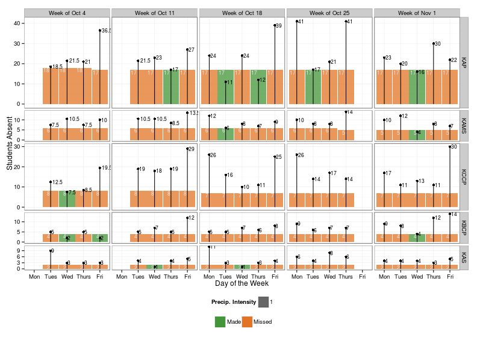
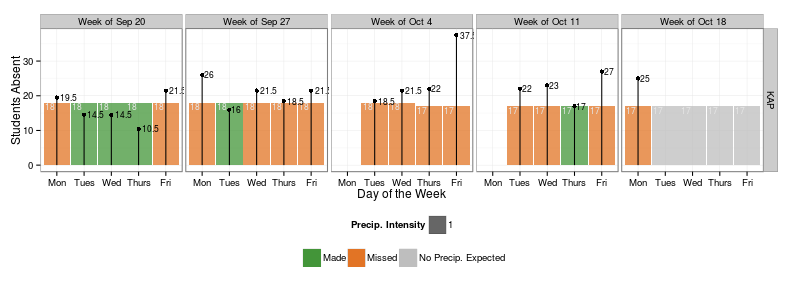
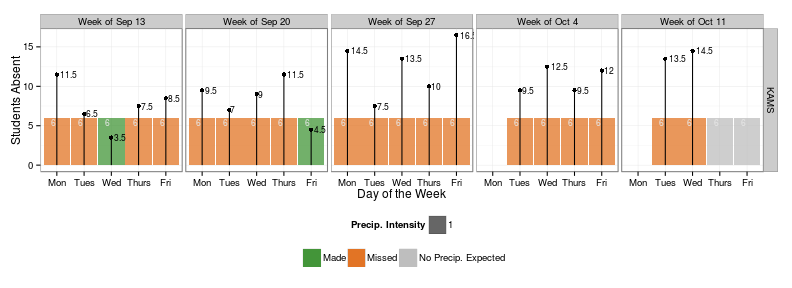
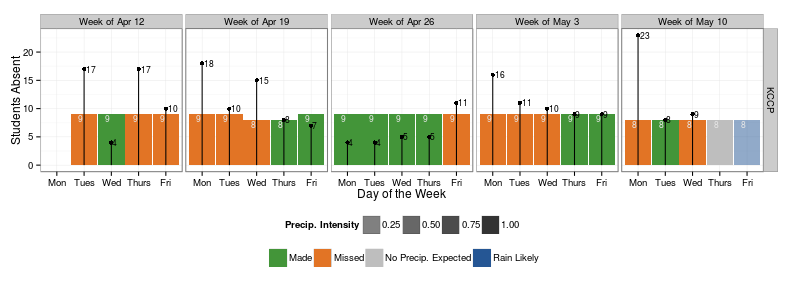
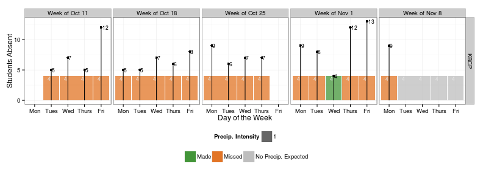

*Attendance data as of Monday, April 20, 2015 at 12:00 PM*

# Weekly Attendance Report
<div mc:edit="time_stamp">time_stamp</div>

For more info go to [KIPP IDEA](idea.kippchicago.org).


### Region
 

### KAP
 

### KAMS
 

### KCCP
 

### KBCP
 


### Summary Table 
<div mc:edit="target_table_html">target_table_html</div>


```r
time_stamp2<-paste0("<i>",time_stamp, "</i>")
   
subject <- lubridate::stamp("Daily Attendance Report for Tuesday, September 14, 2001")(today())

figs<-list.files('figure/')
figs<-paste0('figure/', figs)

email_data<-read.dcf("../config//email.dcf", all = TRUE) %>% as.data.frame

rcpts_region<-strsplit(email_data$region, '\\s*,\\s*')[[1]]
rcpts_kap<-strsplit(email_data$kap, '\\s*,\\s*')[[1]]
rcpts_kams<-strsplit(email_data$kams, '\\s*,\\s*')[[1]]
rcpts_kccp<-strsplit(email_data$kccp, '\\s*,\\s*')[[1]]
rcpts_kbcp<-strsplit(email_data$kbcp, '\\s*,\\s*')[[1]]


message("Mandrill mailing regiona team now")
mandrill_send_template(api_key = keys$mandrill_key,
                       recipient = rcpts_region,
                       subject = subject,
                       template_name = "war-regional-team",
                       sender="data@kippchicago.org",
                       content=list(time_stamp=time_stamp2,
                                    target_table=target_table_html),
                       images=figs[grepl("all", figs)],
                       css=TRUE
)
```

```
## [[1]]
## [[1]]$email
## [1] "chaid@kippchicago.org"
## 
## [[1]]$status
## [1] "sent"
## 
## [[1]]$`_id`
## [1] "02863a7c7ee54d308cac819ed9ef76ff"
## 
## [[1]]$reject_reason
## NULL
## 
## 
## [[2]]
## [[2]]$email
## [1] "agoble@kippchicago.org"
## 
## [[2]]$status
## [1] "sent"
## 
## [[2]]$`_id`
## [1] "8bc629b399624ad790230fdeb36485f1"
## 
## [[2]]$reject_reason
## NULL
## 
## 
## [[3]]
## [[3]]$email
## [1] "msalmonowicz@kippchicago.org"
## 
## [[3]]$status
## [1] "sent"
## 
## [[3]]$`_id`
## [1] "65077e97be6f4b108b23dccc7c958ca0"
## 
## [[3]]$reject_reason
## NULL
## 
## 
## [[4]]
## [[4]]$email
## [1] "apouba@kippchicago.org"
## 
## [[4]]$status
## [1] "sent"
## 
## [[4]]$`_id`
## [1] "38b33e75789647a58a8ece8e10e72b1a"
## 
## [[4]]$reject_reason
## NULL
## 
## 
## [[5]]
## [[5]]$email
## [1] "nboardman@kippchicago.org"
## 
## [[5]]$status
## [1] "sent"
## 
## [[5]]$`_id`
## [1] "30372dea18e74d25b7401a0f3e7ca009"
## 
## [[5]]$reject_reason
## NULL
```

```r
message("Mandrill mailing KAP team now")
mandrill_send_template(api_key = keys$mandrill_key,
                       recipient = rcpts_kap,
                       subject = subject,
                       template_name = "war-kap",
                       sender="data@kippchicago.org",
                       content=list(time_stamp=time_stamp2,
                                    target_table=target_table_html),
                       images=figs[grepl("KAP", figs)],
                       css=TRUE
)
```

```
## [[1]]
## [[1]]$email
## [1] "ebhattacharyya@kippchicago.org"
## 
## [[1]]$status
## [1] "sent"
## 
## [[1]]$`_id`
## [1] "b25ab30ee023498fbd26e8143937a1db"
## 
## [[1]]$reject_reason
## NULL
## 
## 
## [[2]]
## [[2]]$email
## [1] "chaid@kippchicago.org"
## 
## [[2]]$status
## [1] "sent"
## 
## [[2]]$`_id`
## [1] "97e2082225924630922495bb7bb538ae"
## 
## [[2]]$reject_reason
## NULL
```

```r
message("Mandrill mailing KAMS team now")
mandrill_send_template(api_key = keys$mandrill_key,
                       recipient = rcpts_kams,
                       subject = subject,
                       template_name = "war-kams",
                       sender="data@kippchicago.org",
                       content=list(time_stamp=time_stamp2,
                                    target_table=target_table_html),
                       images=figs[grepl("KAMS", figs)],
                       css=TRUE
)
```

```
## [[1]]
## [[1]]$email
## [1] "lhenley@kippchicago.org"
## 
## [[1]]$status
## [1] "sent"
## 
## [[1]]$`_id`
## [1] "2ddf9ff3b0fa456c8e828c0cae546c96"
## 
## [[1]]$reject_reason
## NULL
## 
## 
## [[2]]
## [[2]]$email
## [1] "chaid@kippchicago.org"
## 
## [[2]]$status
## [1] "sent"
## 
## [[2]]$`_id`
## [1] "05bcca15ab1f465e90fa3308652d1309"
## 
## [[2]]$reject_reason
## NULL
```

```r
message("Mandrill mailing KCCP team now")
mandrill_send_template(api_key = keys$mandrill_key,
                       recipient = rcpts_kccp,
                       subject = subject,
                       template_name = "war-kccp",
                       sender="data@kippchicago.org",
                       content=list(time_stamp=time_stamp2,
                                    target_table=target_table_html),
                       images=figs[grepl("KCCP", figs)],
                       css=TRUE
)
```

```
## [[1]]
## [[1]]$email
## [1] "kmazurek@kippchicago.org"
## 
## [[1]]$status
## [1] "sent"
## 
## [[1]]$`_id`
## [1] "1479ad248b5b4864856a122414cc95f8"
## 
## [[1]]$reject_reason
## NULL
## 
## 
## [[2]]
## [[2]]$email
## [1] "chaid@kippchicago.org"
## 
## [[2]]$status
## [1] "sent"
## 
## [[2]]$`_id`
## [1] "5c8dbec2bd9c4a5cb090b82d84c78ca4"
## 
## [[2]]$reject_reason
## NULL
```

```r
message("Mandrill mailing KBCP team now")
mandrill_send_template(api_key = keys$mandrill_key,
                       recipient = rcpts_kbcp,
                       subject = subject,
                       template_name = "war-kbcp",
                       sender="data@kippchicago.org",
                       content=list(time_stamp=time_stamp2,
                                    target_table=target_table_html),
                       images=figs[grepl("KBCP", figs)],
                       css=TRUE
)
```

```
## [[1]]
## [[1]]$email
## [1] "esale@kippchicago.org"
## 
## [[1]]$status
## [1] "sent"
## 
## [[1]]$`_id`
## [1] "7b0110dd60314ef0a278489087376219"
## 
## [[1]]$reject_reason
## NULL
## 
## 
## [[2]]
## [[2]]$email
## [1] "chaid@kippchicago.org"
## 
## [[2]]$status
## [1] "sent"
## 
## [[2]]$`_id`
## [1] "a430ce945cdd4ceebab4bf3986fea7fe"
## 
## [[2]]$reject_reason
## NULL
```


