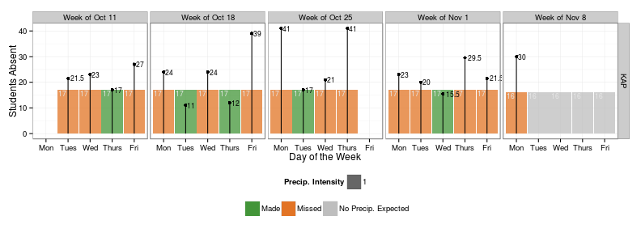
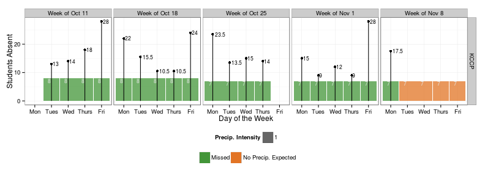

*Attendance data as of Monday, November 09, 2015 at 01:03 PM*

# Weekly Attendance Report
<div mc:edit="time_stamp">time_stamp</div>

For more info go to [KIPP IDEA](idea.kippchicago.org).


### Region
 

### KAP
 

### KAMS
 

### KCCP
 

### KBCP
 
### KAS
 

### Summary Table 
<div mc:edit="target_table_html">target_table_html</div>


```r
time_stamp2<-paste0("<i>",time_stamp, "</i>")
   
subject <- lubridate::stamp("Daily Attendance Report for Tuesday, September 14, 2001")(today())

figs<-list.files('figure/')
figs<-paste0('figure/', figs)

email_data<-read.dcf("../config//email.dcf", all = TRUE) %>% as.data.frame

rcpts_region<-strsplit(email_data$region, '\\s*,\\s*')[[1]]
rcpts_kap<-strsplit(email_data$kap, '\\s*,\\s*')[[1]]
rcpts_kams<-strsplit(email_data$kams, '\\s*,\\s*')[[1]]
rcpts_kccp<-strsplit(email_data$kccp, '\\s*,\\s*')[[1]]
rcpts_kbcp<-strsplit(email_data$kbcp, '\\s*,\\s*')[[1]]


message("Mandrill mailing regiona team now")
mandrill_send_template(api_key = keys$mandrill_key,
                       recipient = rcpts_region,
                       subject = subject,
                       template_name = "war-regional-team",
                       sender="data@kippchicago.org",
                       content=list(time_stamp=time_stamp2,
                                    target_table=target_table_html),
                       images=figs[grepl("all", figs)],
                       css=TRUE
)
```

```
## [[1]]
## [[1]]$email
## [1] "chaid@kippchicago.org"
## 
## [[1]]$status
## [1] "sent"
## 
## [[1]]$`_id`
## [1] "1280dbb44a20445fb91ed76d7bbd1cc0"
## 
## [[1]]$reject_reason
## NULL
## 
## 
## [[2]]
## [[2]]$email
## [1] "agoble@kippchicago.org"
## 
## [[2]]$status
## [1] "sent"
## 
## [[2]]$`_id`
## [1] "020ac77f3a3445b39f33e26c4f688026"
## 
## [[2]]$reject_reason
## NULL
## 
## 
## [[3]]
## [[3]]$email
## [1] "msalmonowicz@kippchicago.org"
## 
## [[3]]$status
## [1] "sent"
## 
## [[3]]$`_id`
## [1] "3f55afab86e54d69bfb2599966c58254"
## 
## [[3]]$reject_reason
## NULL
## 
## 
## [[4]]
## [[4]]$email
## [1] "apouba@kippchicago.org"
## 
## [[4]]$status
## [1] "sent"
## 
## [[4]]$`_id`
## [1] "00877718e95244dbbce391779147c5ed"
## 
## [[4]]$reject_reason
## NULL
## 
## 
## [[5]]
## [[5]]$email
## [1] "nboardman@kippchicago.org"
## 
## [[5]]$status
## [1] "sent"
## 
## [[5]]$`_id`
## [1] "423e7a839a8b452d861b93dc5ef62db9"
## 
## [[5]]$reject_reason
## NULL
```

```r
message("Mandrill mailing KAP team now")
mandrill_send_template(api_key = keys$mandrill_key,
                       recipient = rcpts_kap,
                       subject = subject,
                       template_name = "war-kap",
                       sender="data@kippchicago.org",
                       content=list(time_stamp=time_stamp2,
                                    target_table=target_table_html),
                       images=figs[grepl("KAP", figs)],
                       css=TRUE
)
```

```
## [[1]]
## [[1]]$email
## [1] "chaid@kippchicago.org"
## 
## [[1]]$status
## [1] "sent"
## 
## [[1]]$`_id`
## [1] "cb141ab5d82d430fac38db0f2a74ac94"
## 
## [[1]]$reject_reason
## NULL
## 
## 
## [[2]]
## [[2]]$email
## [1] "ebhattacharyya@kippchicago.org"
## 
## [[2]]$status
## [1] "sent"
## 
## [[2]]$`_id`
## [1] "08ae3fd06a304d5ea81acd630ae3e02b"
## 
## [[2]]$reject_reason
## NULL
```

```r
message("Mandrill mailing KAMS team now")
mandrill_send_template(api_key = keys$mandrill_key,
                       recipient = rcpts_kams,
                       subject = subject,
                       template_name = "war-kams",
                       sender="data@kippchicago.org",
                       content=list(time_stamp=time_stamp2,
                                    target_table=target_table_html),
                       images=figs[grepl("KAMS", figs)],
                       css=TRUE
)
```

```
## [[1]]
## [[1]]$email
## [1] "chaid@kippchicago.org"
## 
## [[1]]$status
## [1] "sent"
## 
## [[1]]$`_id`
## [1] "54f917ceb67d45869cccaa4cf136d946"
## 
## [[1]]$reject_reason
## NULL
## 
## 
## [[2]]
## [[2]]$email
## [1] "lhenley@kippchicago.org"
## 
## [[2]]$status
## [1] "sent"
## 
## [[2]]$`_id`
## [1] "0f658724cc6044f08fed7821dd3e8e1b"
## 
## [[2]]$reject_reason
## NULL
```

```r
message("Mandrill mailing KCCP team now")
mandrill_send_template(api_key = keys$mandrill_key,
                       recipient = rcpts_kccp,
                       subject = subject,
                       template_name = "war-kccp",
                       sender="data@kippchicago.org",
                       content=list(time_stamp=time_stamp2,
                                    target_table=target_table_html),
                       images=figs[grepl("KCCP", figs)],
                       css=TRUE
)
```

```
## [[1]]
## [[1]]$email
## [1] "chaid@kippchicago.org"
## 
## [[1]]$status
## [1] "sent"
## 
## [[1]]$`_id`
## [1] "21d8eb962ad8490d8e9bcd81242c341c"
## 
## [[1]]$reject_reason
## NULL
## 
## 
## [[2]]
## [[2]]$email
## [1] "kmazurek@kippchicago.org"
## 
## [[2]]$status
## [1] "sent"
## 
## [[2]]$`_id`
## [1] "dcdb71ce75114f71b9e9b12dbc2f125b"
## 
## [[2]]$reject_reason
## NULL
```

```r
message("Mandrill mailing KBCP team now")
mandrill_send_template(api_key = keys$mandrill_key,
                       recipient = rcpts_kbcp,
                       subject = subject,
                       template_name = "war-kbcp",
                       sender="data@kippchicago.org",
                       content=list(time_stamp=time_stamp2,
                                    target_table=target_table_html),
                       images=figs[grepl("KBCP", figs)],
                       css=TRUE
)
```

```
## [[1]]
## [[1]]$email
## [1] "chaid@kippchicago.org"
## 
## [[1]]$status
## [1] "sent"
## 
## [[1]]$`_id`
## [1] "f5a85b3c5e3649ee80aac949d2b42aed"
## 
## [[1]]$reject_reason
## NULL
## 
## 
## [[2]]
## [[2]]$email
## [1] "esale@kippchicago.org"
## 
## [[2]]$status
## [1] "sent"
## 
## [[2]]$`_id`
## [1] "57c14c7b5d954941928f08a1fea911b1"
## 
## [[2]]$reject_reason
## NULL
```

```r
message("Mandrill mailing KAS team now")
mandrill_send_template(api_key = keys$mandrill_key,
                       recipient = rcpts_kas,
                       subject = subject,
                       template_name = "war-kas",
                       sender="data@kippchicago.org",
                       content=list(time_stamp=time_stamp2,
                                    target_table=target_table_html),
                       images=figs[grepl("KAS", figs)],
                       css=TRUE
)
```

```
## Error in data.frame(email = recipient, stringsAsFactors = FALSE): object 'rcpts_kas' not found
```


